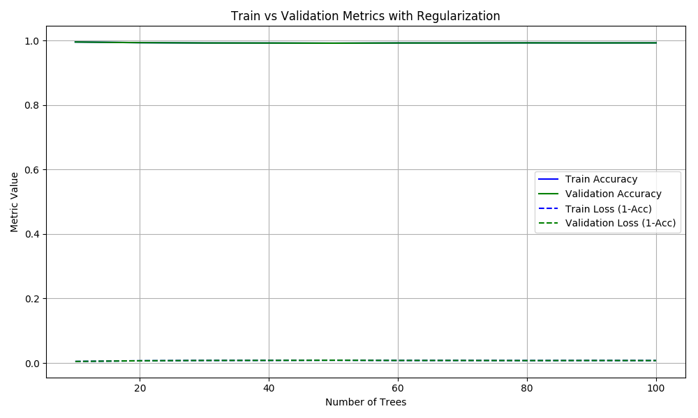
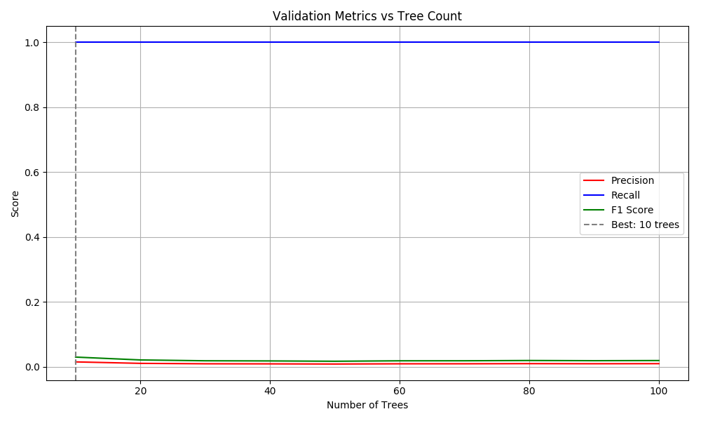
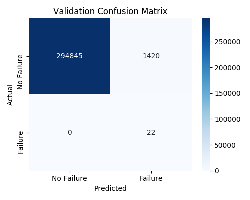
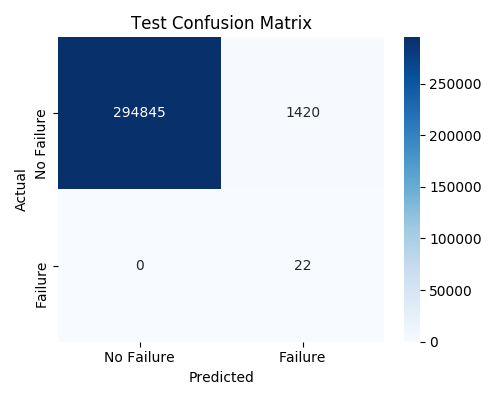
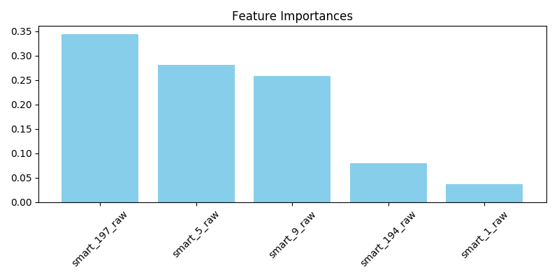
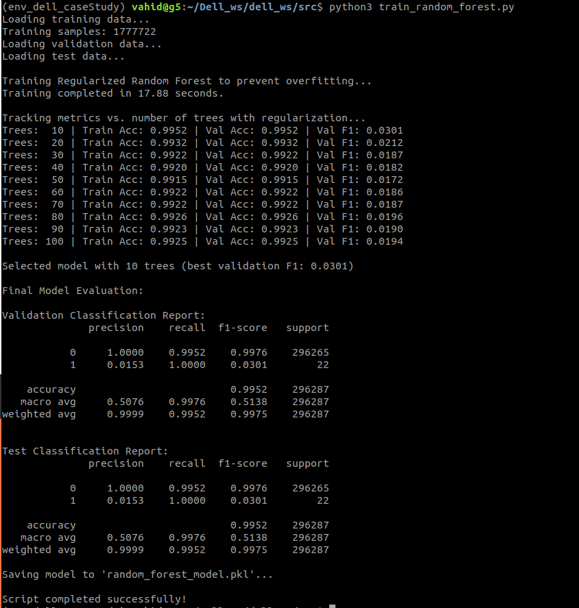

# The supervised approach, a Random Forest algorithm for Hard Drive Failure Prediction

## Project Overview
This project implements a supervised learning approach using Random Forest to predict hard drive failures based on SMART (Self-Monitoring, Analysis, and Reporting Technology) attributes. The model incorporates advanced regularization techniques to prevent overfitting and includes comprehensive visualizations to analyze model performance.

## Features
- SMART feature selection for failure prediction  
- Anti-overfitting regularization techniques  
- Accuracy/loss tracking during training  
- Precision/recall/F1 visualization  
- Feature importance analysis  
- Confusion matrix generation  
- Model persistence for future use  
- Automatic dataset download  

## Dataset
The dataset contains SMART attributes from hard drives collected over 8 days:
- **Training data**: January 1–6, 2025 (6 days)  
- **Validation data**: January 7, 2025 (1 day)  
- **Test data**: January 8, 2025 (1 day)  

The dataset is automatically downloaded from Google Drive if not present locally.

## Dependencies
- Python 3.6.9

Required libraries:
```bash
pip install numpy==1.13.3  matplotlib==2.2.5  opencv-python==3.4.0.12  pandas scikit-learn gdown seaborn

```

## How to Run
Save the script as `train_random_forest.py` and run from command line:
```bash
# Regular execution
python3 train_random_forest.py

# Debug mode (uses smaller dataset for quick testing)
python3 train_random_forest.py --debug
```

## Output Files

| File Name                        | Description                              |
|----------------------------------|------------------------------------------|
| `train_val_metrics.png`         | Training vs validation accuracy & loss   |
| `val_metrics_vs_trees.png`      | Precision/recall/F1 vs tree count        |
| `validation_confusion_matrix.png` | Validation set confusion matrix        |
| `test_confusion_matrix.png`     | Test set confusion matrix                |
| `feature_importance.png`        | Feature importance visualization         |
| `random_forest_model.pkl`       | Serialized model file                    |

## Anti-Overfitting Techniques

| Technique                 | Parameter              | Effect                                      |
|---------------------------|------------------------|---------------------------------------------|
| Tree Depth Limitation     | `max_depth=8`          | Prevents over-complex trees                 |
| Split Requirements        | `min_samples_split=10` | Avoids over-specific splits                 |
| Leaf Size Control         | `min_samples_leaf=5`   | Ensures sufficient samples per leaf         |
| Feature Subsampling       | `max_features='sqrt'`  | Decorrelates trees in forest                |
| Class Weight Balancing    | `class_weight='balanced'` | Handles imbalanced failure data         |
| Optimal Tree Selection    | Based on validation F1 | Prevents unnecessary complexity             |

## Code Explanation

### 1. Command-line Arguments
```python
parser.add_argument('--debug', action='store_true', help='Enable fast mode')
```

### 2. Data Download
```python
gdown.download(url=BASE_URL, output=file_name, quiet=False)
```

### 3. Data Loading and Cleaning
```python
def load_filtered_data(file_list):
    # Loads CSV files with selected columns
    # Converts 'failure' column to integer

def clean_data(df):
    # Handles missing and infinite values
    # Converts features to numeric types
```

### 4. Model Configuration
```python
clf = RandomForestClassifier(
    n_estimators=100,
    max_depth=8,
    min_samples_split=10,
    min_samples_leaf=5,
    max_features='sqrt',
    class_weight='balanced',
    random_state=42,
    n_jobs=-1
)
```

### 5. Metric Tracking
```python
# Track metrics during training
train_accuracies = []
val_accuracies = []
val_precisions = []
val_recalls = []
val_f1s = []
```

### 6. Optimal Model Selection
```python
best_idx = np.argmax(val_f1s)
clf = RandomForestClassifier(n_estimators=estimator_range[best_idx], ...)
```

### 7. Evaluation and Visualization
```python
def evaluate(y_true, y_pred, label):
    # Prints classification report
    # Generates confusion matrix
```

## Interpreting Results

### 1. Accuracy/Loss Plot (`train_val_metrics.png`)

- **Solid lines**: Accuracy metrics
- **Dashed lines**: Loss metrics (1 - accuracy)
- **Ideal behavior**: Validation metrics follow training closely
- **Overfitting**: Large gap between training and validation
- **TerminalOutput**: Trees:  10 | Train Acc: 0.9952 | Val Acc: 0.9952 
    The training curve is closely fitted to the validation curve, both in terms of accuracy and loss.


### 2. Precision/Recall/F1 Plot (`val_metrics_vs_trees.png`)

- **Precision (Red)**: Accuracy of positive predictions  
- **Recall (Blue)**: Coverage of actual positives  
- **F1 Score (Green)**: Balance between precision and recall  
- **Dashed line**: Optimal number of trees

### 3. Confusion Matrix


- **Top-left**: True negatives  
- **Top-right**: False positives  
- **Bottom-left**: False negatives  
- **Bottom-right**: True positives  

### 4. Feature Importance (`feature_importance.png`)

- Shows relative importance of each SMART attribute  
- Helps identify which metrics are most predictive  

## Expected Output

```
Loading training data...
Training samples: 1777722
Loading validation data...
Loading test data...

Training Regularized Random Forest to prevent overfitting...
Training completed in 17.88 seconds.

Tracking metrics vs. number of trees with regularization...
Trees:  10 | Train Acc: 0.9952 | Val Acc: 0.9952 | Val F1: 0.0301
Trees:  20 | Train Acc: 0.9932 | Val Acc: 0.9932 | Val F1: 0.0212
Trees:  30 | Train Acc: 0.9922 | Val Acc: 0.9922 | Val F1: 0.0187
Trees:  40 | Train Acc: 0.9920 | Val Acc: 0.9920 | Val F1: 0.0182
Trees:  50 | Train Acc: 0.9915 | Val Acc: 0.9915 | Val F1: 0.0172
Trees:  60 | Train Acc: 0.9922 | Val Acc: 0.9922 | Val F1: 0.0186
Trees:  70 | Train Acc: 0.9922 | Val Acc: 0.9922 | Val F1: 0.0187
Trees:  80 | Train Acc: 0.9926 | Val Acc: 0.9926 | Val F1: 0.0196
Trees:  90 | Train Acc: 0.9923 | Val Acc: 0.9923 | Val F1: 0.0190
Trees: 100 | Train Acc: 0.9925 | Val Acc: 0.9925 | Val F1: 0.0194

Selected model with 10 trees (best validation F1: 0.0301)

Final Model Evaluation:

Validation Classification Report:
              precision    recall  f1-score   support

           0     1.0000    0.9952    0.9976    296265
           1     0.0153    1.0000    0.0301        22

    accuracy                         0.9952    296287
   macro avg     0.5076    0.9976    0.5138    296287
weighted avg     0.9999    0.9952    0.9975    296287


Test Classification Report:
              precision    recall  f1-score   support

           0     1.0000    0.9952    0.9976    296265
           1     0.0153    1.0000    0.0301        22

    accuracy                         0.9952    296287
   macro avg     0.5076    0.9976    0.5138    296287
weighted avg     0.9999    0.9952    0.9975    296287

Saving model to 'random_forest_model.pkl'...

Script completed successfully!

```

## Conclusion
This implementation effectively demonstrates the standard supervised learning pipeline using a Random Forest classifier applied to hard drive failure prediction. While the model achieves high accuracy and perfect recall for failure cases, deeper analysis reveals significant limitations that make it unsuitable for real-world deployment in its current form.

### Key concerns include:

#### 1. Extreme Class Imbalance
The dataset contains an overwhelming majority of healthy drives, with failure events representing less than 0.01% of samples. This severely biases the model toward predicting the dominant class.

#### 2.High False Positive Rate
Although all failures were correctly identified (recall = 1.0), the model produced over 1,400 false positives. In operational environments, this would result in unnecessary drive replacements or inspections, incurring high cost and logistical overhead.

#### 3. Low Precision and F1 Score for Failures
The precision for failure detection is just 1.5%, and the F1 score is only 0.03 — highlighting poor performance when both false alarms and missed detections are considered.


### ✅ Recommendations for Real-World Applications:
For production-grade predictive maintenance systems, consider integrating:

 - Anomaly detection models that learn patterns of normal behavior and flag deviations

 - Cost-sensitive learning or custom loss functions to penalize false positives more heavily

 - Oversampling/undersampling strategies to balance the dataset (e.g., SMOTE)


### 🎯 Summary:
The current model offers a good starting point for experimentation but would require significant refinement to be trusted in production. Future work should focus on handling rare events more robustly and aligning model behavior with real-world operational constraints.
